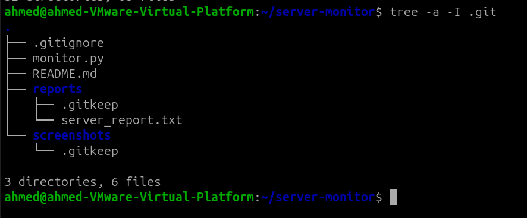

# Server Health Monitor

## Project Description

A Python-based Linux server monitoring tool that collects important system information and generates a server health report automatically.

## Features

- Hostname monitoring
- Current user monitoring
- Current date and time
- Operating system detection
- Kernel version detection
- CPU usage monitoring
- Memory usage monitoring
- Disk usage monitoring
- Primary IPv4 address detection
- System uptime monitoring
- Automatic server health report generation

## Technologies Used

- Linux
- Python 3
- Git
- GitHub
- psutil

## Project Structure

```text
server-monitor/
├── monitor.py
├── reports/
│   └── server_report.txt
├── screenshots/
├── README.md
├── .gitignore
└── requirements.txt


## Installation

1. Clone the repository:
```bash
git clone https://github.com/ahmed-elamen-dev/server-monitor.git
cd server-monitor

 ```
## How to Run


Run the monitoring script using:

```bash
python3 monitor.py


The script automatically generates a server health report inside:

```text
reports/server_report.txt


## Sample Output


```text
Hostname : ahmed-VMware-Virtual-Platform
Current User : ahmed
Operating System : Linux
Kernel Version : 7.0.0-29-generic
CPU Usage : 4.3 %

Memory Usage:
Total : 7.11 GB
Used : 2.30 GB
Free : 1.33 GB
Usage : 32.3 %

Disk Usage:
Total : 97.87 GB
Used : 12.64 GB
Free : 80.22 GB
Usage : 13.6 %

IP Address : 192.168.62.128
Uptime : 0 Days, 3 Hours, 25 Minutes
```

## Git Commit History


## GitHub Repository


